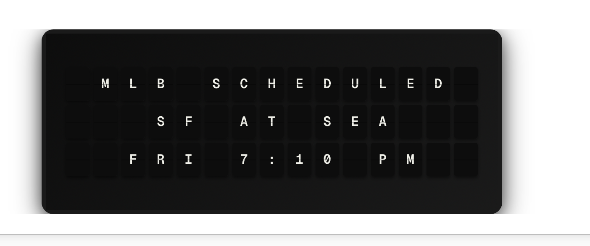

# Favorite Sports Setup



1. Install the plugin from its public GitHub HTTPS URL.
2. Open **Integrations** and enable **Favorite Sports**.
3. Select MLB, NFL, or both.
4. Choose favorite teams separately for each league.
5. Set the timezone used to display upcoming game times.
6. Keep the default refresh and relevance settings initially.
7. Choose **Favorite Sports for Note** as the trigger page.

## Recommended Note Page

Create a three-line page using:

```text
{{favorite_sports.line1}}
{{favorite_sports.line2}}
{{favorite_sports.line3}}
```

Center all three rows. These fields are already limited to 15 tiles.

## When Games Appear

- Live matching games rank first.
- Recently completed games rank next and remain eligible for the configured number of hours.
- Upcoming matching games follow, ordered by start time.
- Older finals are removed automatically.
- If no favorite teams are selected for a league, all teams in that league are eligible.

MLB and NFL team settings are separate, so identical abbreviations cannot be confused across leagues.

## Collections and Alerts

To select the sports page during the 30 minutes before a game, add this rule to a variable-mode collection:

```text
AND(favorite_sports.state == "scheduled", favorite_sports.minutes_until_start >= 0, favorite_sports.minutes_until_start <= 30)
```

To keep the sports page selected throughout a live game, add:

```text
favorite_sports.state == "live"
```

Rules are for steady conditions. Use the plugin's start, score, and final alert settings for momentary events. Those triggers briefly replace the current page, then FiestaBoard resumes the active schedule or collection automatically. All three alert types are enabled by default and can be disabled independently.

## Troubleshooting

### No matching game appears

- Confirm the desired league is enabled.
- Confirm the team is selected, or leave that league's team list empty to include every game.
- Increase **Upcoming Game Window** if the next game is more than seven days away.
- Recent final scores disappear after **Keep Final Scores** expires. The default is 12 hours.

### Alerts do not appear

- Enable the corresponding score, final, or game-start alert setting.
- Select a trigger page in FiestaBoard for this plugin.
- The first successful fetch establishes a baseline and intentionally emits no alert.
- A transition from scheduled to live is treated as a game-start event before any score comparison occurs.

### One league is temporarily unavailable

MLB and NFL are fetched independently. A working provider can continue supplying games if the other provider fails; FiestaBoard logs the provider error for diagnosis.
